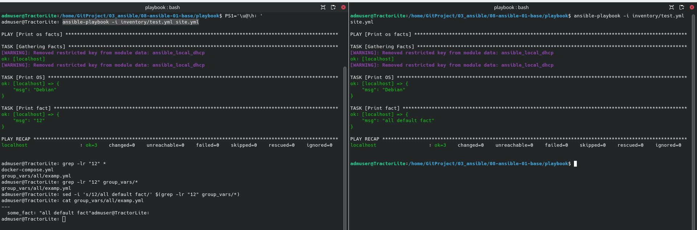
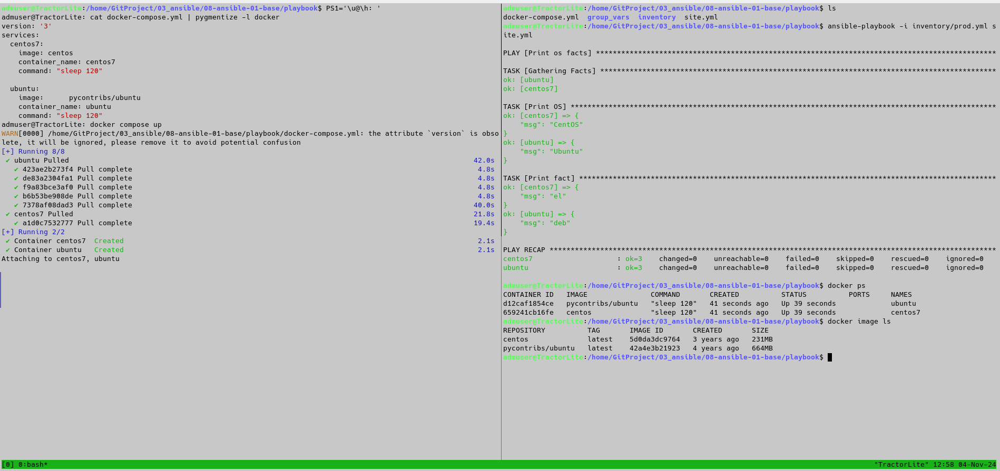
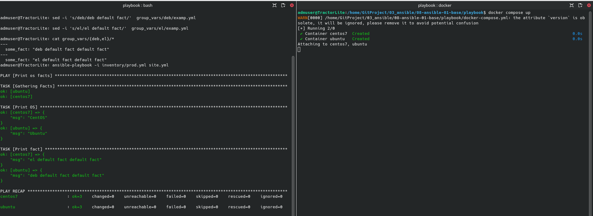
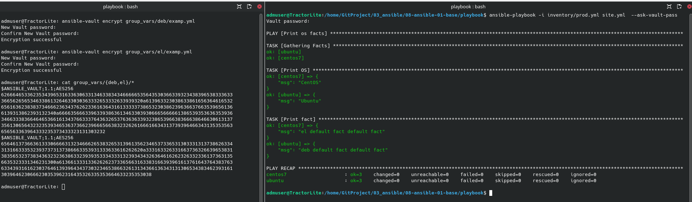
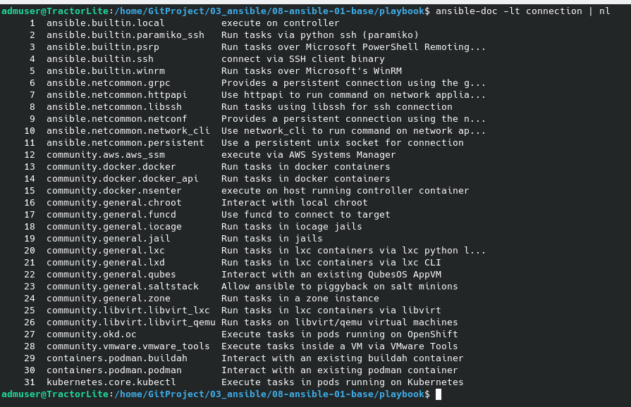
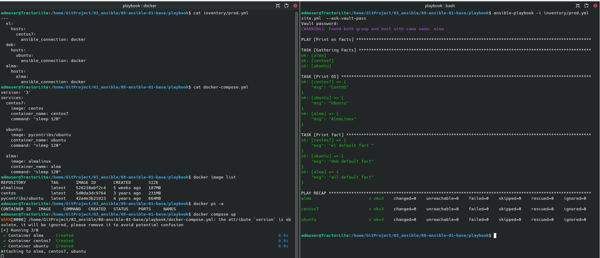

## 
ОТЧЕТ
 
по домашним заданиям к занятию «Введение в Ansible»

## 
Выполнил: студент ___________.

## Подготовка к выполнению

1. Установите Ansible версии 2.10 или выше.
2. Создайте свой публичный репозиторий на GitHub с произвольным именем.
3. Скачайте [Playbook](./playbook/) из репозитория с домашним заданием и перенесите его в свой репозиторий.

## Основная часть  

1. Попробуйте запустить playbook на окружении из `test.yml`, зафиксируйте значение, которое имеет факт `some_fact` для указанного хоста при выполнении playbook.
2. Найдите файл с переменными (group_vars), в котором задаётся найденное в первом пункте значение, и поменяйте его на `all default fact`.
3. Воспользуйтесь подготовленным (используется `docker`) или создайте собственное окружение для проведения дальнейших испытаний.
4. Проведите запуск playbook на окружении из `prod.yml`. Зафиксируйте полученные значения `some_fact` для каждого из `managed host`.
5. Добавьте факты в `group_vars` каждой из групп хостов так, чтобы для `some_fact` получились значения: для `deb` — `deb default fact`, для `el` — `el default fact`.
6.  Повторите запуск playbook на окружении `prod.yml`. Убедитесь, что выдаются корректные значения для всех хостов.
7. При помощи `ansible-vault` зашифруйте факты в `group_vars/deb` и `group_vars/el` с паролем `netology`.
8. Запустите playbook на окружении `prod.yml`. При запуске `ansible` должен запросить у вас пароль. Убедитесь в работоспособности.
9. Посмотрите при помощи `ansible-doc` список плагинов для подключения. Выберите подходящий для работы на `control node`.
10. В `prod.yml` добавьте новую группу хостов с именем  `local`, в ней разместите localhost с необходимым типом подключения.
11. Запустите playbook на окружении `prod.yml`. При запуске `ansible` должен запросить у вас пароль. Убедитесь, что факты `some_fact` для каждого из хостов определены из верных `group_vars`.
12. Заполните `README.md` ответами на вопросы. Сделайте `git push` в ветку `master`. В ответе отправьте ссылку на ваш открытый репозиторий с изменённым `playbook` и заполненным `README.md`.
13. Предоставьте скриншоты результатов запуска команд.

### 
Решение

>по пунктам 1-2
    

>по пунктам 3-4
 

>по пунктам 5-6
 

>по пунктам 7-8
 

>по пункту 9
 

>по пунктам 10-11
 

## Необязательная часть

1. При помощи `ansible-vault` расшифруйте все зашифрованные файлы с переменными.
2. Зашифруйте отдельное значение `PaSSw0rd` для переменной `some_fact` паролем `netology`. Добавьте полученное значение в `group_vars/all/exmp.yml`.
3. Запустите `playbook`, убедитесь, что для нужных хостов применился новый `fact`.
4. Добавьте новую группу хостов `fedora`, самостоятельно придумайте для неё переменную. В качестве образа можно использовать [этот вариант](https://hub.docker.com/r/pycontribs/fedora).
5. Напишите скрипт на bash: автоматизируйте поднятие необходимых контейнеров, запуск ansible-playbook и остановку контейнеров.
6. Все изменения должны быть зафиксированы и отправлены в ваш личный репозиторий.

---

### Как оформить решение задания

Выполненное домашнее задание пришлите в виде ссылки на .md-файл в вашем репозитории.

---
